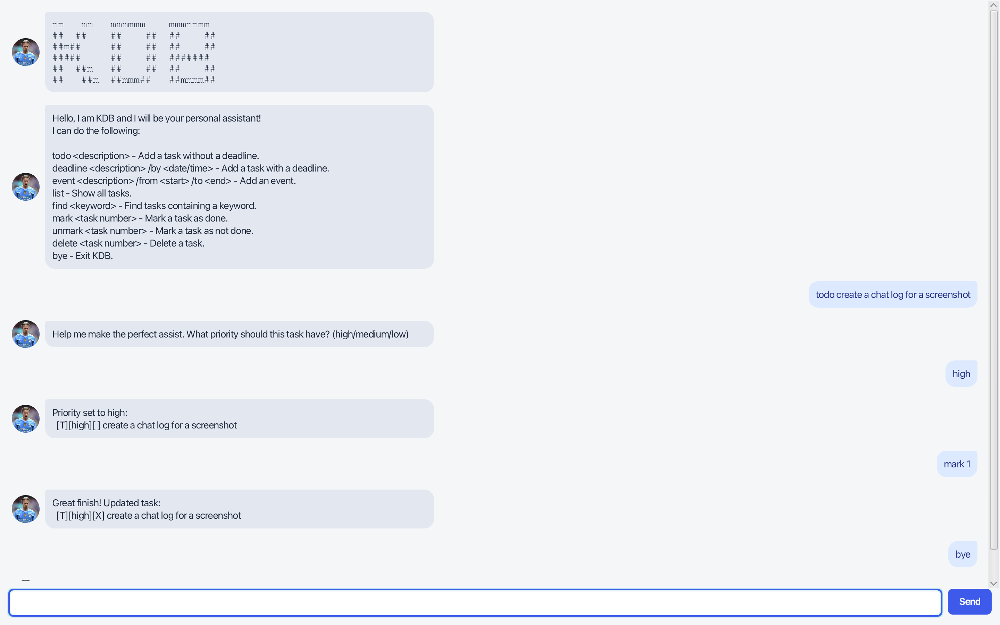

# KDB User Guide

KDB is a personal task assistant inspired by Kevin De Bruyne, the assist
king. It helps you add, organise, search, complete, and remove tasks using
simple commands.



## Getting started

KDB requires JDK 25 and must be started through Gradle. From the project root,
run:

```bash
./gradlew run
```

In IntelliJ, you can also open the Gradle panel and run
`Tasks > application > run`. Do not compile or run `Launcher.java` directly.
The graphical interface opens with the KDB welcome message and command guide.

Type a command into the input box and press Enter or click **Send**. You can
resize the window; the conversation area and input box adjust automatically.

KDB saves tasks in `data/tasks.txt`, so tasks remain available the next time
the application starts.

## Running the packaged JAR

To create the executable fat JAR, run this command from the project root:

```bash
./gradlew clean shadowJar
```

The JAR is created at `build/libs/Kdb.jar`. To smoke-test it, copy `Kdb.jar`
to an empty folder, open a terminal in that folder, and run:

```bash
java -jar "Kdb.jar"
```

The application should start normally and create its `data/tasks.txt` file
beside the JAR when tasks are saved.

## Commands

| Command | Purpose | Example |
| --- | --- | --- |
| `todo <description>` | Adds a task without a deadline. | `todo read chapter 5` |
| `deadline <description> /by <date/time>` | Adds a task with a deadline. | `deadline submit report /by 2/12/2019 1800` |
| `event <description> /from <start> /to <end>` | Adds an event with a start and end time. | `event project meeting /from Monday 2pm /to 3pm` |
| `list` | Displays all saved tasks. | `list` |
| `find <keyword>` | Finds tasks whose descriptions contain the keyword. Search is case-insensitive. | `find report` |
| `mark <task number>` | Marks a task as complete. | `mark 1` |
| `unmark <task number>` | Marks a task as incomplete. | `unmark 1` |
| `delete <task number>` | Removes a task from the list. | `delete 1` |
| `bye` | Closes KDB. | `bye` |

Task numbers are shown by the `list` command and start at 1.

## Setting priorities

After adding a todo, deadline, or event, KDB asks for a priority. Enter one
of the following values:

```text
high
medium
low
```

Priority names are not case-sensitive. If the input is blank, KDB uses
`medium`. If the value is not recognised, KDB keeps asking for a valid
priority.

## Date and time format

Deadline dates use the following format:

```text
d/M/yyyy HHmm
```

For example:

```text
deadline submit report /by 5/9/2026 1800
```

The event start and end values are displayed as entered, so they can use
natural descriptions such as `Monday 2pm` and `3pm`.

## Handling errors

KDB highlights invalid input with a red error message in the GUI. Common
errors include:

- An unknown command.
- A missing task description, keyword, date, or event time.
- An invalid date or time.
- A task number that does not exist.
- An invalid priority.
- A task file with malformed or unexpected data.
- A task file that cannot be read or written.

When an error occurs, correct the command and try again. Existing tasks are
kept unless a valid delete command is used.

## Example session

```text
todo prepare presentation
high
list
mark 1
find presentation
unmark 1
delete 1
bye
```
